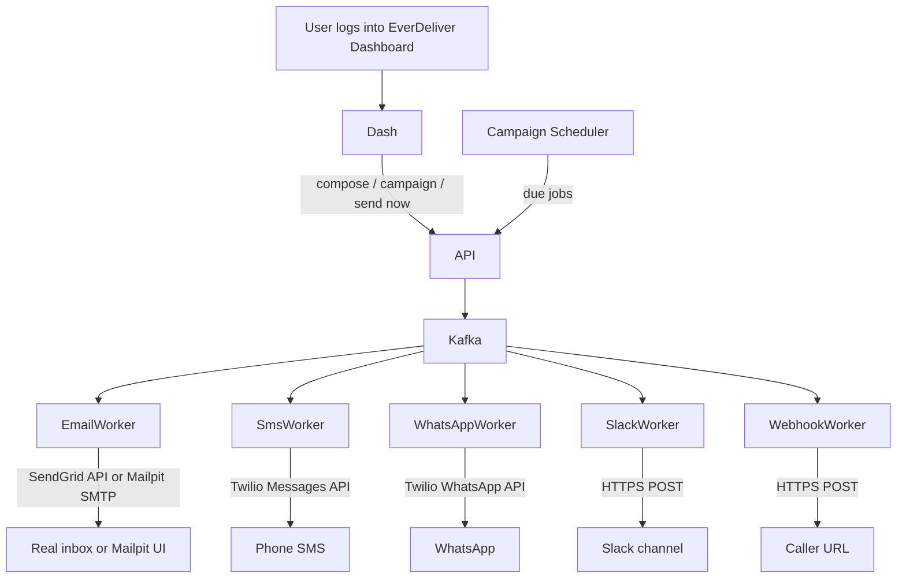

# EverDeliver — Product Specification

## Overview

EverDeliver is becoming a **self-hosted multi-channel messaging / campaign platform**. Users log into the EverDeliver dashboard, connect delivery providers (SendGrid for email, Twilio for SMS/WhatsApp), create reusable message templates, pick audiences, and send immediately or on a schedule (e.g. “send this template to these 20 numbers, up to 10 per day at 9am”).

Underlying delivery still uses Kafka workers. The dashboard is the product surface; the REST API remains for programmatic sends.

This document is the source of truth for **what** we are building and **when** architecture choices must be confirmed. Each phase is self-contained and must be confirmed before implementation begins.

### Related docs (repo)

| Doc | Status | Role |
|---|---|---|
| [SPEC.md](SPEC.md) (this file) | Exists | Product phases, user stories, decision gates |
| [README.md](../README.md) | Exists | How to run the current Phase 1 stack |
| [ARCHITECTURE.md](ARCHITECTURE.md) | Exists | System diagram, modules, Kafka topics, ownership boundaries |
| [ADR/](ADR/) | Exists | Short records of locked technical decisions |
| [DATA_MODEL.md](DATA_MODEL.md) | Exists | Tables, statuses, campaign/template schema |
| [LOCAL_SETUP.md](LOCAL_SETUP.md) | Exists | SendGrid / Twilio / Mailpit env setup |
| [SECURITY.md](SECURITY.md) | Exists | Secrets handling for Integrations settings |
| [AGENTS.md](../AGENTS.md) | Exists | Agent overview / workflow |
| [phase4prompt.md](phase4prompt.md) | Exists | Handoff prompt for Phase 4 (dashboard) |
| `.cursor/rules/everdeliver-*.mdc` | Exists | Force AIs to stop at SPEC architecture checkboxes |

Do not invent architecture in code without an ADR (or a checked decision in this SPEC).

---

## Product Vision (scoped)

### What users do in the dashboard

1. **Sign in to EverDeliver** (your app accounts — not Gmail/Twilio OAuth as the primary login).
2. Open **Settings → Integrations** and paste provider credentials:
   - SendGrid API key (+ verified from-domain / from-email)
   - Twilio Account SID, Auth Token, SMS from-number, WhatsApp from-number
3. Create **message templates** (subject/body, channel-specific fields).
4. Create **audiences** (lists of emails / phone numbers).
5. Create **campaigns / schedules**: choose template + audience + channel + timing rules (one-shot at time T, or recurring e.g. daily at 09:00 with a daily send cap).
6. Watch delivery status, retries, and stats on the dashboard.

### Two models — pick the one we are building

| Model | How it works | Complexity |
|---|---|---|
| **A — Recommended (v1)** | User logs into EverDeliver. They paste SendGrid + Twilio keys in Settings. EverDeliver sends *as* those providers. | Resume-sized, weeks–months |
| **B — Full “connect accounts” SaaS** | “Sign in with Google” to send from Gmail, OAuth into Twilio, multi-tenant billing, token vaults, refresh flows. | Much larger product; defer |

**Locked for this project: Model A.**

Users do **not** “log into Gmail inside the dashboard” for v1. They log into EverDeliver and configure provider API keys. That still sends **real** emails and texts.

### Best option for real email: SendGrid

| Option | Verdict |
|---|---|
| **SendGrid (recommended)** | Built for app/transactional email. API key auth. Free tier for testing. Good resume story. |
| Amazon SES | Also strong; slightly more AWS setup. Fine alternative. |
| Gmail SMTP / OAuth | Possible for personal demos; rate limits, spam risk, not designed for scheduled campaigns. Avoid as primary. |
| Mailpit | Keep for local/dev so builds work with zero cloud accounts. |

**Locked for this project:** Email = **SendGrid API** in “real” mode; **Mailpit** remains the default for local Docker without keys.

### Explicitly out of scope (v1)

- OAuth “Sign in with Google to send as my Gmail”
- Multi-tenant SaaS billing / orgs marketplace
- WhatsApp Business template approval automation (support fields; document manual Twilio/Meta setup)
- Sending from the user’s personal phone SIM

---

## Guiding Principles

1. **No silent architecture decisions.** Before implementing any phase, the AI must confirm: database schema, new Kafka topics/consumer groups, new API contracts, new dependencies, and any design pattern choices.
2. **Incremental delivery.** Each phase produces a working, testable system.
3. **Existing stack first.** Prefer extending current patterns (Spring Boot, Gradle modules, Docker Compose) unless there is a clear reason to change.
4. **Secrets stay secret.** Provider keys are stored encrypted or as env-backed config — never committed; never returned in full via API.

---

## How Delivery Actually Works

### Email

- **Local/dev:** Spring `JavaMailSender` → Mailpit (unchanged).
- **Real:** Email worker calls **SendGrid Web API** (or SendGrid SMTP) using the configured API key and verified from-address.
- Dashboard never talks to SendGrid directly for sends; it calls EverDeliver API; workers deliver.

### SMS / WhatsApp (Twilio)

Unchanged from prior plan: Twilio Java SDK, SMS from a Twilio number, WhatsApp via Twilio sandbox then production-capable config. Credentials come from Integrations settings (or env for bootstrap).

### Slack / Webhook

Incoming Webhook URL and generic HTTPS POST, as before.

### Config sources (priority)

1. Per-user / per-workspace Integration settings stored in DB (product path)
2. Environment variables for local/single-operator bootstrap and CI

---

## Current State (Phase 3 — Complete)

- REST API accepts `POST /api/v1/notifications` with a flat multi-channel body (`channel` defaults to `email`; `{email, subject, message}` still works) and returns `{ id, status: "QUEUED" }`
- Notifications persisted in PostgreSQL (`everdeliver-persistence` + Flyway); status lifecycle `QUEUED → PROCESSING → SENT|FAILED`, with `FAILED → PROCESSING` retries then `DEAD`
- `GET /api/v1/notifications/{id}` and `GET /api/v1/notifications?status=&since=&limit=` (includes `retryCount`, `lastError`, `providerMessageId`)
- Publishes to Kafka topic `notification-topic` (payload includes `id` + `channel` + `recipient`)
- Worker consumes, updates status in DB directly, and delivers via channel senders: SendGrid or Mailpit (email), Twilio (SMS/WhatsApp), Slack Incoming Webhook, generic HTTP webhook
- Retryable failures go through `notification-topic-retry-5000|30000|120000`; exhausted/permanent failures land on `notification-topic-dlq` with status `DEAD`
- Fully Dockerized (Kafka KRaft, PostgreSQL, Mailpit, echo-server, API, Worker)
- Locked decisions: [ADR-0001](ADR/0001-phase1-persistence.md), [ADR-0002](ADR/0002-phase2-retry-dlq.md), [ADR-0003](ADR/0003-phase3-multi-channel.md)
- Known limitation: no transactional outbox yet (API DB↔Kafka dual-write; still deferred)

---

## Phase 1 — Persistence & Status Tracking

### Goal
Every notification gets a permanent record with lifecycle status updates.

### User Stories

- US-1.1: As a sender, I want to receive a notification ID in the API response so I can track its delivery.
- US-1.2: As a sender, I want to query `GET /api/v1/notifications/{id}` to see the current status (QUEUED, PROCESSING, SENT, FAILED).
- US-1.3: As an operator, I want to list recent notifications with filters (status, date range) via `GET /api/v1/notifications`.

### Architecture Decisions (MUST CONFIRM BEFORE IMPLEMENTING)

- [x] Database choice: PostgreSQL (recommended) vs H2 for dev? → **PostgreSQL** ([ADR-0001](ADR/0001-phase1-persistence.md))
- [x] ORM: Spring Data JPA (recommended) vs Spring JDBC? → **Spring Data JPA**
- [x] Where does persistence live: in the API module, worker module, or a new shared persistence module? → **`everdeliver-persistence`**
- [x] Schema design: confirm table structure and indexes (include `channel`, `providerMessageId` for Twilio/SendGrid IDs) → see [DATA_MODEL.md](DATA_MODEL.md) / ADR-0001
- [x] Should the worker update status directly in DB, or publish a status event back to Kafka? → **Worker updates DB directly**

### Acceptance Criteria

- [x] POST response includes `{ id, status: "QUEUED" }`
- [x] Worker updates status to PROCESSING then SENT (or FAILED)
- [x] GET by ID returns current status and timestamps
- [x] GET list supports `?status=` and `?since=` query params (also `?limit=`)
- [x] PostgreSQL runs in Docker Compose

---

## Phase 2 — Dead Letter Queue & Retries

### Goal
Failed deliveries are retried with backoff. Permanently failed messages are captured for inspection.

### User Stories

- US-2.1: As an operator, I want failed notifications to be retried up to N times with exponential backoff.
- US-2.2: As an operator, I want permanently failed notifications moved to a DLQ and marked as DEAD in the database.
- US-2.3: As an operator, I want to see retry count and last error message on a notification record.

### Architecture Decisions (MUST CONFIRM BEFORE IMPLEMENTING)

- [x] Retry strategy: Kafka-native retry topics vs application-level retry with scheduled tasks? → **Kafka `@RetryableTopic`** ([ADR-0002](ADR/0002-phase2-retry-dlq.md))
- [x] Max retry count and backoff intervals → **4 attempts (1 + 3 retries), 5s / 30s / 2m**
- [x] DLQ topic naming convention → **`notification-topic-dlq`** (retry topics `notification-topic-retry-5000|30000|120000`)
- [x] Error storage: how much error detail to persist (stack trace vs message only)? → **message only, truncated to 1024**
- [x] How to treat provider 4xx (bad address) vs 5xx/timeouts (retryable) for Twilio and SendGrid? → **Phase 2 SMTP: connection/timeout retryable, invalid address permanent; Phase 3 HTTP: 4xx non-retryable, 5xx/timeout retryable**

### Acceptance Criteria

- A simulated provider failure triggers retries
- After max retries, message lands in DLQ topic and DB status = DEAD
- Notification record shows `retryCount` and `lastError`

---

## Phase 3 — Multi-Channel Delivery (SendGrid Email + Twilio SMS/WhatsApp + Slack + Webhook)

### Goal
Real multi-channel delivery behind one API. Email uses SendGrid when configured, Mailpit otherwise.

### User Stories

- US-3.1: As a sender, I want to specify `channel: "email" | "sms" | "whatsapp" | "slack" | "webhook"`.
- US-3.2: As a sender, I want channel-specific fields validated (email address, phone E.164, Slack URL, etc.).
- US-3.3: As an operator, I want channel failures isolated so one channel does not block others.
- US-3.4: As a sender, I want real SMS via Twilio.
- US-3.5: As a sender, I want WhatsApp via Twilio (sandbox first).
- US-3.6: As a sender, I want real email via SendGrid when an API key is configured.
- US-3.7: As a developer, I want local Docker to keep using Mailpit when SendGrid is not configured.
- US-3.8: As an operator, I want provider message IDs (Twilio SID / SendGrid message id) stored on the notification.

### Architecture Decisions (MUST CONFIRM BEFORE IMPLEMENTING)

- [x] Routing: single Kafka topic + headers vs topic per channel? → **keep `notification-topic` + `channel` field** ([ADR-0003](ADR/0003-phase3-multi-channel.md))
- [x] Worker layout: modules vs strategy pattern in one worker? → **strategy pattern in `everdeliver-worker`**
- [x] API contract: polymorphic body vs flat optional fields? → **flat body, backward compatible**
- [x] Email transport switch: SendGrid Java SDK vs SMTP-to-SendGrid vs WebClient REST? → **SendGrid `Mail` builder + RestClient; Mailpit fallback**
- [x] Twilio: official Java SDK vs WebClient? → **official Twilio Java SDK**
- [x] Shared Twilio client for SMS + WhatsApp? → **yes — one client, two senders**
- [x] WhatsApp v1: free-form sandbox only vs also template SID + variables? → **sandbox free-form only**
- [x] Slack Incoming Webhook for v1? → **yes**
- [x] Credentials at this phase: env-only first, then Settings UI in Phase 5? → **env-only**

### Acceptance Criteria

- [x] All five channels have a working delivery path
- [x] Without SendGrid key → email goes to Mailpit; with key → real email via SendGrid
- [x] Twilio SMS/WhatsApp work with documented sandbox/setup steps
- [x] Provider IDs persisted when available
- [x] README documents SendGrid + Twilio setup

---

## Phase 4 — Dashboard (Delivery Console)

### Goal
Web UI for live notification feed, filters, stats, and manual retry.

### User Stories

- US-4.1: Live feed of notifications with status changes.
- US-4.2: Filter by channel, status, time range.
- US-4.3: Aggregate stats (success rate, latency, failures by channel).
- US-4.4: Manually retry a failed notification.

### Architecture Decisions (MUST CONFIRM BEFORE IMPLEMENTING)

- [ ] Frontend: React (Vite) vs Next.js vs Thymeleaf?
- [ ] Real-time: SSE vs WebSocket vs polling?
- [ ] Hosting: separate container vs served from API?
- [ ] Charting library?
- [ ] CSS approach: Tailwind vs component library?

### Acceptance Criteria

- Dashboard runs on a configured port
- Live/updated notification list + stats
- Retry action works

---

## Phase 5 — Dashboard Users & Integrations Settings

### Goal
Users authenticate to EverDeliver and connect SendGrid + Twilio via the dashboard (paste keys), matching Product Model A.

### User Stories

- US-5.1: As a user, I can register/login to the EverDeliver dashboard.
- US-5.2: As a user, I can save SendGrid API key and from-email in Settings → Integrations.
- US-5.3: As a user, I can save Twilio credentials and from-numbers in Settings → Integrations.
- US-5.4: As a user, I can test a connection (“send test email / test SMS”) from Settings.
- US-5.5: As a user, I never see full secrets again after save (masked display only).

### Architecture Decisions (MUST CONFIRM BEFORE IMPLEMENTING)

- [ ] Auth: session cookies vs JWT vs Spring Security form login?
- [ ] Single-user personal deploy vs multi-user from day one?
- [ ] Secret storage: encrypt-at-rest in Postgres vs OS env only vs vault?
- [ ] Do workers read per-user credentials, or only a global workspace config for v1?
- [ ] Out of scope confirmation: no Gmail OAuth for v1?

### Acceptance Criteria

- Login required for dashboard
- Integrations page saves/masks credentials
- Sends use saved credentials when present
- Test-send buttons work for email and SMS when configured

---

## Phase 6 — Templates, Audiences & Scheduled Campaigns

### Goal
Predetermined messages + audience lists + schedules (the “send 10 a day at this time” product).

### User Stories

- US-6.1: As a user, I can create/edit message templates (name, channel, subject/body, placeholders like `{{name}}`).
- US-6.2: As a user, I can create audiences (list of email or phone recipients).
- US-6.3: As a user, I can send a template to an audience immediately (“Send now”).
- US-6.4: As a user, I can schedule a one-shot campaign for a future datetime.
- US-6.5: As a user, I can create a recurring schedule (e.g. daily at 09:00) with a **daily send cap** (e.g. max 10 messages/day) and optional pacing.
- US-6.6: As a user, I can pause/resume/cancel a campaign.
- US-6.7: As a user, I can see per-campaign delivery progress (queued/sent/failed).

### Architecture Decisions (MUST CONFIRM BEFORE IMPLEMENTING)

- [ ] Scheduler: Spring `@Scheduled` + DB due-jobs vs Quartz vs separate scheduler service?
- [ ] How daily caps work: round-robin through audience vs sticky cursor / “next unsent” pointer?
- [ ] Timezones: store UTC + user timezone field?
- [ ] Template placeholders: simple mustache-style vs no placeholders in v1?
- [ ] Campaign execution: enqueue one Kafka message per recipient vs batch API?
- [ ] Compliance guardrails: hard max recipients per day for SMS to avoid accidental spend?

### Acceptance Criteria

- Templates and audiences CRUD in dashboard + API
- Send now works end-to-end on at least email and SMS
- One-shot schedule fires at the right time
- Recurring schedule respects daily cap (e.g. 10/day)
- Pause/cancel stops further enqueues
- Campaign progress visible in UI

---

## Phase 7 — Programmatic API Hardening

### Goal
API keys, idempotency, batch send, OpenAPI — for integrations beyond the UI.

### User Stories

- US-7.1: API key auth for programmatic clients.
- US-7.2: Idempotency keys prevent duplicate sends.
- US-7.3: Batch send endpoint.
- US-7.4: Swagger/OpenAPI docs.

### Architecture Decisions (MUST CONFIRM BEFORE IMPLEMENTING)

- [ ] API keys vs reuse dashboard JWT for API?
- [ ] Idempotency storage: DB vs Redis?
- [ ] Batch size limits?
- [ ] Rate limiting: none vs bucket4j vs gateway?

### Acceptance Criteria

- Invalid/missing API key → 401
- Idempotent replay returns original result
- Batch + Swagger work

---

## Phase 8 — Observability

### Goal
Metrics, Grafana, structured logs, optional tracing.

### User Stories

- US-8.1: Prometheus metrics for throughput/latency/errors (include channel + campaign labels where useful).
- US-8.2: Grafana dashboards shipped in Docker Compose.
- US-8.3: Structured JSON logs with correlation IDs.
- US-8.4: (Stretch) OpenTelemetry tracing.

### Architecture Decisions (MUST CONFIRM BEFORE IMPLEMENTING)

- [ ] Micrometer vs custom?
- [ ] Logback JSON vs Log4j2?
- [ ] Correlation ID via Kafka headers vs MDC?
- [ ] Tracing now or later?

### Acceptance Criteria

- `/actuator/prometheus` scraped
- Grafana shows volume / success / fail / p95
- Logs include `correlationId`
- Prometheus + Grafana in Compose

---

## Phase 9 — CI/CD & Deployment

### Goal
Automated build/test/image publish; optional K8s.

### User Stories

- US-9.1: PRs build and test via GitHub Actions.
- US-9.2: Main publishes Docker images.
- US-9.3: (Stretch) K8s/Helm manifests.

### Architecture Decisions (MUST CONFIRM BEFORE IMPLEMENTING)

- [ ] GitHub Actions vs other?
- [ ] GHCR vs Docker Hub?
- [ ] Helm vs Kustomize vs skip K8s?
- [ ] Testcontainers vs unit-only?
- [ ] Stub SendGrid/Twilio in CI (WireMock) vs skip provider ITs?

### Acceptance Criteria

- CI green on PR
- Images published on main
- (Stretch) K8s deploy path documented

---

## How to Use This Spec

When starting a new phase:
1. Read the relevant phase section
2. Present the architecture decisions to the user for confirmation
3. Only after all decisions are confirmed, begin implementation
4. Mark acceptance criteria as done when complete
5. Do not proceed to the next phase without explicit instruction
